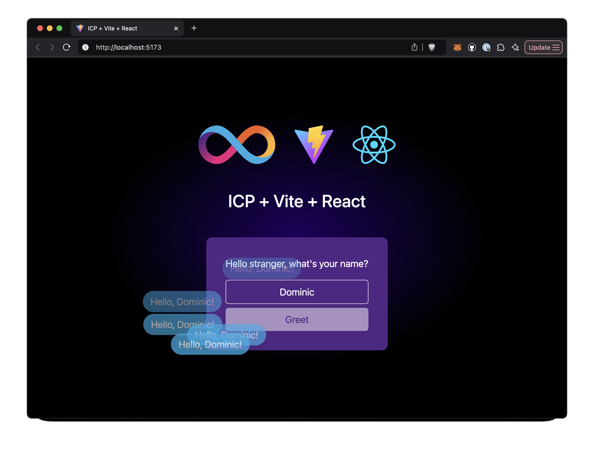

# SIWE Demo

> [!TIP]
> This demo is a modified version of the [ic-vite-react-next](https://github.com/kristoferlund/ic-vite-react-next) template that adds an Ethereum wallet connect button as well as integration with the [ic-siwe](https://github.com/kristoferlund/ic-siwe) library that allows the user to create an IC identity based on an Ethereum signed message.

**From the template README:**

This template provides a batteries included setup for an ICP/React application with the latest versions of Vite, TypeScript, Tailwind CSS, SWC, Eslint and React Query.

[![Contributors][contributors-shield]][contributors-url]
[![Forks][forks-shield]][forks-url]
[![Stargazers][stars-shield]][stars-url]
[![Issues][issues-shield]][issues-url]
[![MIT License][license-shield]](LICENSE)



## Features

### Backend

The Rust based backend exposes one endpoint only, the `greet` function that returns a greeting message.

### Frontend

The React/Vite/TS based frontend allows the user to input a name and click a button to fetch the greeting message from the backend.

Dependencies:

- [SWC](https://swc.rs/): The Rust based compiler and bundler that provides up to 70x faster build times than Babel.
- [Tailwind 4](https://tailwindcss.com/docs/v4-beta): The new version of Tailwind CSS is a ground-up rewrite of the framework, providing faster builds, great new CSS classes and better performance.
- [Vite 6](https://vite.dev/): The most significant major release since Vite 2, featuring a new Environment API for enhanced flexibility, extended framework support, and streamlined performance for modern web development.
- [Eslint 9](https://eslint.org/): The latest release of Eslint introduces the flat configuration API along with new rules and bug fixes.
- [Tanstack Query 5](https://tanstack.com/query/latest): The template uses Tanstack Query for data fetching, caching and loading state management.
- [shadcn/ui](https://ui.shadcn.com/): Sorry, no. Shadcn is not available for Tailwind 4 yet. Soon hopefully.

## Setup, dev environment

There are two main ways to set up the dev environment:

### 1. Using a VS Code Dev Container

The dev containers extension lets you use a Docker container as a full-featured
development environment. This repository includes a dev container configuration
that you can use to open the project with all the necessary tools and
dependencies pre-installed.

Pre-requisites:

- [Docker](https://www.docker.com/products/docker-desktop)
- [Visual Studio Code](https://code.visualstudio.com/)
- [Dev Containers Extension](https://marketplace.visualstudio.com/items?itemName=ms-vscode-remote.remote-containers)

Once Docker, Visual Studio Code and the Dev Containers Extension are installed,
you can open the project in a container by clicking the button below:

[](https://vscode.dev/redirect?url=vscode://ms-vscode-remote.remote-containers/cloneInVolume?url=https://github.com/kristoferlund/ic-vite-react-next)

### 2. Setup manually

Pre-requisites:

- [Local Internet Computer dev environment](https://internetcomputer.org/docs/current/developer-docs/backend/rust/dev-env)
- [pnpm](https://pnpm.io/installation)

Once you have the prerequisites installed, you can clone this repository and run
the project.

## Running the project

### 1. Start the Internet Computer

```bash
dfx start --background
```

### 2. Install dependencies

```
pnpm install
```

### 3. Deploy the canisters

```
dfx deploy
```

## Develop

During development, you can run the frontend with hot reloading using Vite.

```bash
pnpm run dev
```

[contributors-shield]: https://img.shields.io/github/contributors/kristoferlund/ic-vite-react-next.svg?style=for-the-badge
[contributors-url]: https://github.com/kristoferlund/ic-vite-react-next/graphs/contributors
[forks-shield]: https://img.shields.io/github/forks/kristoferlund/ic-vite-react-next.svg?style=for-the-badge
[forks-url]: https://github.com/kristoferlund/ic-vite-react-next/network/members
[stars-shield]: https://img.shields.io/github/stars/kristoferlund/ic-vite-react-next?style=for-the-badge
[stars-url]: https://github.com/kristoferlund/ic-vite-react-next/stargazers
[issues-shield]: https://img.shields.io/github/issues/kristoferlund/ic-vite-react-next.svg?style=for-the-badge
[issues-url]: https://github.com/kristoferlund/ic-vite-react-next/issues
[license-shield]: https://img.shields.io/github/license/kristoferlund/ic-vite-react-next.svg?style=for-the-badge
